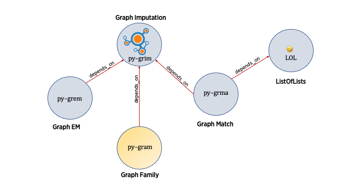

Graph Family

`py-gram` is the Graph Family package. It is based on [py-grim](https://github.com/nmdp-bioinformatics/py-grim)



How to develop on the project locally:

1. Make sure the following pre-requites are installed.
   1. `git`
   2. `python >= 3.8`
   3. build tools eg `make`
2. Clone the repository locally
    ```shell
    git clone git@github.com:nmdp-bioinformatics/py-gram.git
    cd py-gram
    ```
3. Make a virtual environment and activate it, run `make venv`
   ```shell
    > make venv
      python3 -m venv venv --prompt urban-potato-venv
      =====================================================================
    To activate the new virtual environment, execute the following from your shell
    source venv/bin/activate
   ```
4. Source the virtual environment
   ```shell
   source venv/bin/activate
   ```
5. Development workflow is driven through `Makefile`. Use `make` to list show all targets.
   ```
    > make
    clean                remove all build, test, coverage and Python artifacts
    clean-build          remove build artifacts
    clean-pyc            remove Python file artifacts
    clean-test           remove test and coverage artifacts
    lint                 check style with flake8
    behave               run the behave tests, generate and serve report
    pytest               run tests quickly with the default Python
    test                 run all(BDD and unit) tests
    coverage             check code coverage quickly with the default Python
    dist                 builds source and wheel package
    docker-build         build a docker image for the service
    docker               build a docker image for the service
    install              install the package to the active Python's site-packages
    venv                 creates a Python3 virtualenv environment in venv
    activate             activate a virtual environment. Run `make venv` before activating.
   ```
6. Install all the development dependencies. Will install packages from all `requirements-*.txt` files.
   ```shell
    make install
   ```
7. The Gherkin Feature files, step files and pytest files go in `tests` directory:
    ```
    tests
    |-- features
    |   |-- algorithm
    |   |   `-- SLUG\ Match.feature
    |   `-- definition
    |       `-- Class\ I\ HLA\ Alleles.feature
    |-- steps
    |   |-- HLA_alleles.py
    |   `-- SLUG_match.py
    `-- unit
        `-- test_gram.py
    ```
8. Package Module files go in the `gram` directory.
    ```
    gram
    |-- __init__.py
    |-- algorithm
    |   `-- match.py
    |-- model
    |   |-- allele.py
    |   `-- slug.py
    `-- gram.py
    ```
9. Run all tests with `make test` or different tests with `make behave` or `make pytest`. `make behave` will generate report files and open the browser to the report.
10. Use `python app.py` to run the Flask service app in debug mode. Service will be available at http://localhost:8080/
11. Use `make docker-build` to build a docker image using the current `Dockerfile`.
12. `make docker` will build and run the docker image with the service.  Service will be available at http://localhost:8080/
